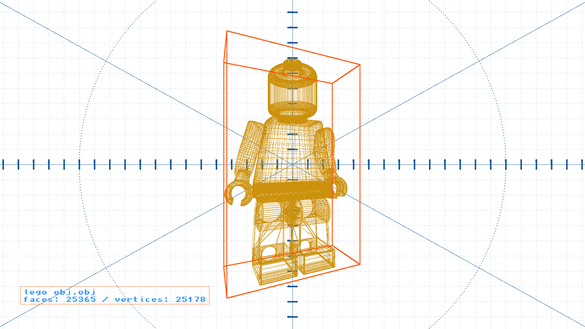

<h1 align="center">
     
</h1>

This project is a personal project developed with a main focus on improvement of C++ skills.

It provides an executable for creating simple turntable wireframe rendering from `OBJ` files.

To do so, it uses basic implementations of some interesting entities such as:
- An OBJ files reader/parser
- 2D shapes
- 3D shapes
- Color
- Drawing brushes

### Turntable frame examples
<table align="center">
  <tr>
    <td align="center">
    <td align="center">
  </tr>
</table>

***

### 🎥 Vimeo demo
<a href="https://vimeo.com/419082896">OBJ renderer demo</a> from <a href="https://vimeo.com/jaimervq">Jaime Rivera</a> on <a href="https://vimeo.com">Vimeo</a>.